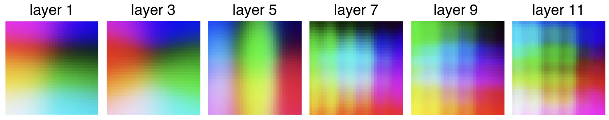
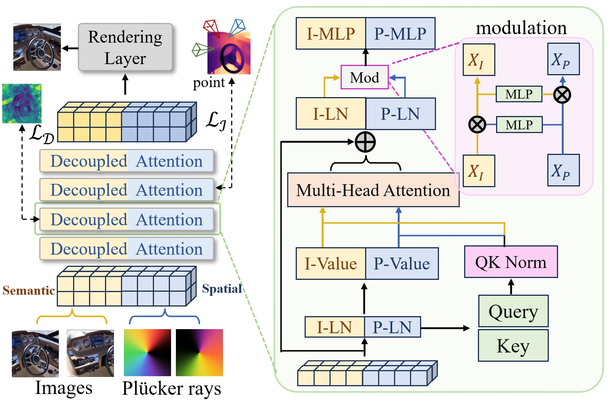
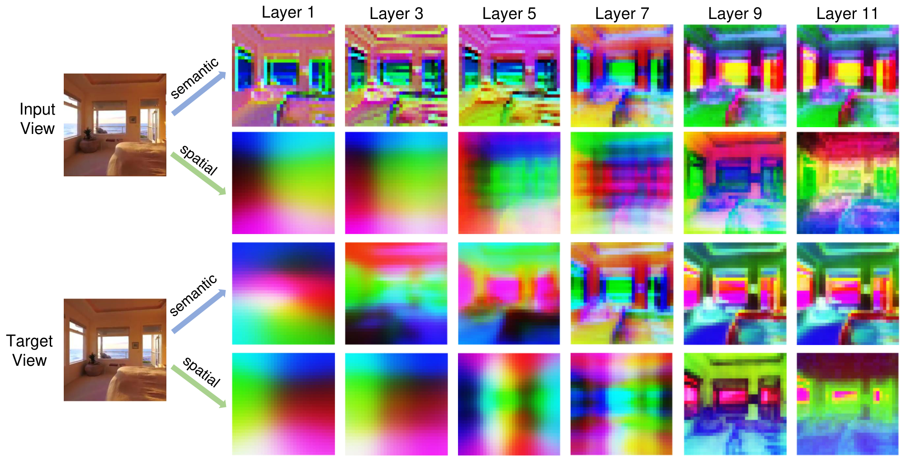
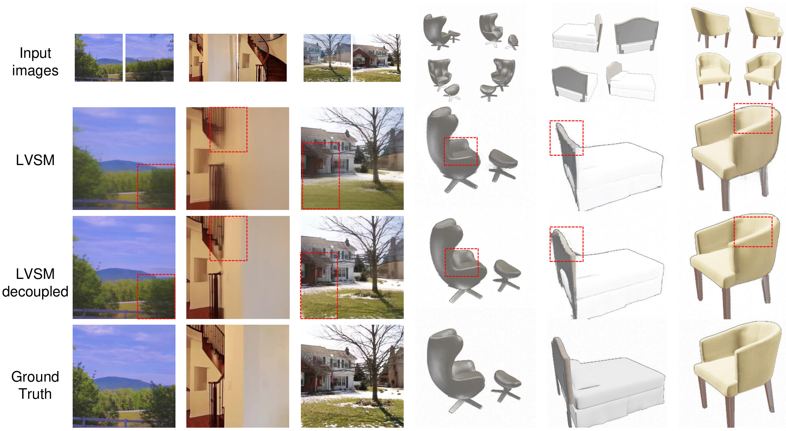
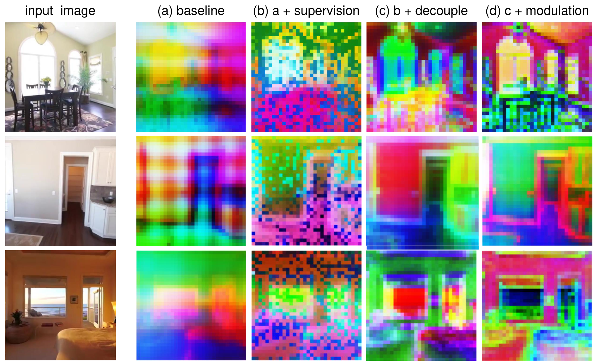

<div align="center">

# Resolving Representation Ambiguity in Feedforward Novel View Synthesis Transformer via Semantic-Spatial Decoupling

**Semantic-Spatial Decoupling for feedforward novel view synthesis transformers**

<p>
  
  <a href="https://hangzay.github.io/ssd_lvsm/"></a>
  <a href="https://github.com/hangzay/ssd_lvsm"></a>
  <a href="LICENSE.md"></a>
</p>

<p><strong>Yihang Wu¹*, Yihang Sun²*, Shaofeng Zhang³, Zuxuan Wu¹, Junchi Yan², Xiaosong Jia¹†</strong></p>
<p>
  ¹ Institute of Trustworthy Embodied Artificial Intelligence (TEAI), Fudan University<br>
  ² Sch. of Computer Science &amp; Sch. of Artificial Intelligence, Shanghai Jiao Tong University<br>
  ³ School of Information and Software Engineering, University of Science and Technology of China
</p>
<p>* Equal contribution. † Corresponding author.</p>

Contact: [yh048172@gmail.com](mailto:yh048172@gmail.com)

</div>

## 🌐 Overview

Feedforward novel view synthesis transformers often combine RGB appearance tokens and Plucker-ray geometry tokens in one representation stream. This creates representation ambiguity: semantic appearance and camera-space geometry compete inside the same latent features.

Semantic-Spatial Decoupling keeps appearance and geometry as coordinated but distinct branches. RGB patch tokens form the semantic branch, Plucker-ray patch tokens form the spatial branch, shared Q/K attention preserves routing, and branch-specific values preserve heterogeneous feature updates.

<p align="center">
  
</p>

The teaser summarizes the central observation: geometry-heavy Plucker features and appearance-heavy RGB features benefit from different update paths, even when they should still exchange information through attention.

## 🔍 Problem Evidence

<p align="center">
  
</p>

Plucker-ray representations develop grid-like spatial structure across layers. This is direct evidence that geometry can dominate the shared latent space when camera rays and RGB appearance are entangled in a single stream.

## 🧩 Method Overview

<p align="center">
  
</p>

The model separates semantic and spatial tokens while keeping them synchronized through attention. Independent-V attention shares query-key routing between branches but applies branch-specific value projections, so semantic and spatial features can evolve without collapsing into one mixed representation.

The full configuration adds branch-specific training supervision and lightweight bidirectional modulation. DINOv3/iREPA supervision targets the semantic branch, DA3-derived geometric consistency targets the spatial branch, and modulation lets the branches condition each other without merging their latent states.

## 🧠 Feature Analysis

<p align="center">
  
</p>

Layer-wise visualizations show the semantic and spatial branches taking on different roles as depth increases. The semantic branch tracks appearance structure, while the spatial branch keeps geometry and camera-dependent patterns explicit.

## 📊 Controlled Reimplementation Results

The following numbers are **controlled reimplementation results**, not direct comparisons against official large-scale LVSM checkpoints. Within each benchmark, the baseline and decoupled variants use the same codebase, data split, view sampling protocol, 256x256 resolution, 50K-step schedule, and training budget. These tables are intended to isolate the effect of semantic-spatial decoupling under a fixed budget.

**Training configuration for the main table**

| Benchmark | Backbone | Views | Resolution | GPUs | Steps | Time |
| --- | --- | --- | --- | --- | --- | --- |
| RE10K decoder-only | 12-layer decoder-only, hidden dim 768 | 2 input / 6 target | 256x256 | 4x A100 80G | 50K | about 8 h / 32 GPU-hours |
| Objaverse decoder-only | 12-layer decoder-only, hidden dim 768 | 4 input / 8 target | 256x256 | 8x A100 80G | 50K | about 15 h / 120 GPU-hours |
| RE10K encoder-decoder | 12-layer encoder + 12-layer decoder, hidden dim 768 | 2 input / 6 target | 256x256 | 4x A100 80G | 50K | about 12 h / 48 GPU-hours |

| Architecture | Dataset | Model | PSNR up | SSIM up | LPIPS down |
| --- | --- | --- | ---: | ---: | ---: |
| Decoder-only | RE10K | Baseline | 26.10 | 0.839 | 0.144 |
| Decoder-only | RE10K | Ours (full) | **27.21** | **0.869** | **0.125** |
| Decoder-only | Objaverse | Baseline | 23.75 | 0.864 | 0.150 |
| Decoder-only | Objaverse | Ours (full) | **26.46** | **0.899** | **0.101** |
| Encoder-decoder | RE10K | Baseline | 24.06 | 0.775 | 0.206 |
| Encoder-decoder | RE10K | Ours (full) | **25.31** | **0.806** | **0.154** |

**Fixed-budget RE10K decoder-only component control**

This table uses the RE10K decoder-only training configuration above: 12 decoder layers, 2 input / 6 target views, 256x256 resolution, 4x A100 80G, 50K training steps, about 8 wall-clock hours.

| Configuration | PSNR up | SSIM up | LPIPS down |
| --- | ---: | ---: | ---: |
| Decoupled base | 26.70 | 0.851 | 0.138 |
| Decoupled + supervision | 26.91 | 0.857 | 0.134 |
| Decoupled + modulation | 27.06 | 0.860 | 0.131 |
| Decoupled full | **27.21** | **0.869** | **0.125** |

## 🖼️ Qualitative Results

<p align="center">
  
</p>

The qualitative comparison highlights sharper synthesized structure and cleaner target-view consistency under the same controlled training budget.

<p align="center">
  
</p>

The representative comparison shows where the decoupled design reduces artifacts caused by mixing spatial bias into appearance features.

## ⚙️ Why Low Overhead

The base decoupled design preserves the original token width and keeps shared Q/K attention routing, so the inference path remains close to the entangled decoder-only backbone. The full model adds lightweight bidirectional modulation, while the DINOv3 teacher, iREPA projector, DA3 supervision cache, and branch-specific losses are training-only modules removed at inference.

## 🛠️ Preparation

Create the environment and install dependencies from the project root:

```bash
conda create -n decoupled-nvs python=3.11
conda activate decoupled-nvs
pip install -r requirements.txt
```

The code expects CUDA, distributed `torchrun`, and `xformers` memory-efficient attention. Prepare `configs/api_keys.yaml` from `configs/api_keys_example.yaml` before WandB logging. DINOv3 teacher weights are loaded from the local Hugging Face cache first and downloaded automatically when missing; gated model access must be approved before the first run.

## 📦 Data

Preprocess RealEstate10K-style raw `.torch` files with:

```bash
python process_data.py --base_path path_to_raw_re10k/ --output_dir path_to_re10k_processed/ --mode train
```

For RealEstate10K, replace `path_to_re10k_processed/` and `path_to_re10k_da3_cache/` in the configs before launching training or evaluation. For Objaverse, render/preprocess data into the layout referenced by `configs/objaverse_decoder_only.yaml`, then replace `path_to_objaverse_rendered_data/`, `path_to_objaverse_da3_cache/`, and `path_to_objaverse_scene_lists/`.

Spatial supervision expects a DA3 cache per scene or object under `training.da3_cache_root`:

```text
<da3_cache_root>/<scene_id>/depth.zarr
<da3_cache_root>/<scene_id>/camera_pose.zarr
<da3_cache_root>/<scene_id>/camera_intrinsics.zarr
```

## 🚀 Training

The released experiment families are:

| Family | Config | Public variants |
| --- | --- | --- |
| RealEstate10K decoder-only | `configs/re10k_decoder_only.yaml` | `training.variant=basic` and `training.variant=full` |
| RealEstate10K encoder-decoder | `configs/re10k_encoder_decoder.yaml` | full design |
| Objaverse decoder-only | `configs/objaverse_decoder_only.yaml` | full design |

Run the full RealEstate10K decoder-only model with:

```bash
bash scripts/train_re10k_decoder_full.sh
```

Override layer count and per-GPU batch size directly when launching:

```bash
torchrun --nproc_per_node 4 --nnodes 1 \
  --rdzv_id 18636 --rdzv_backend c10d --rdzv_endpoint localhost:29503 \
  train.py --config configs/re10k_decoder_only.yaml \
  training.variant=full \
  model.transformer.n_layer=12 \
  training.batch_size_per_gpu=4
```

Other released training entry points:

```bash
bash scripts/train_re10k_decoder_basic.sh
bash scripts/train_re10k_encoder_decoder.sh
bash scripts/train_objaverse_decoder.sh
```

## 🧪 Evaluation

Evaluate a RealEstate10K decoder-only checkpoint with:

```bash
bash scripts/eval_re10k_decoder.sh
```

Other released evaluation entry points:

```bash
bash scripts/eval_re10k_encoder_decoder.sh
bash scripts/eval_objaverse_decoder.sh
```

Set `training.checkpoint_dir=path_to_checkpoint_or_dir/` and `inference_out_dir=path_to_eval_output/` as command-line overrides when needed. Evaluation writes images, metrics, and optional HTML pages under `inference_out_dir`.
