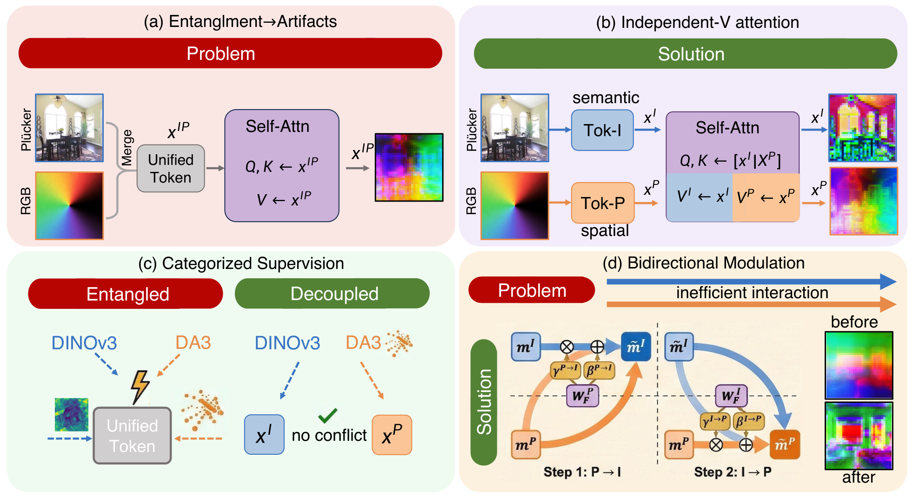

<div align="center">

# Resolving Representation Ambiguity in Feedforward Novel View Synthesis Transformer via Semantic-Spatial Decoupling

**Semantic-Spatial Decoupling for feedforward novel view synthesis transformers**

<p>
  
  <a href="https://hangzay.github.io/ssd_lvsm/"></a>
  <a href="https://github.com/hangzay/ssd_lvsm"></a>
  <a href="LICENSE.md"></a>
</p>

<p><strong>Yihang Wu<sup>1,2*</sup>, Yihang Sun<sup>3*</sup>, Shaofeng Zhang<sup>4</sup>, Zuxuan Wu<sup>1,2</sup>, Junchi Yan<sup>3&dagger;</sup>, Xiaosong Jia<sup>1,2&dagger;</sup>, Yu-gang Jiang<sup>1,2</sup></strong></p>
<p>
  <sup>1</sup> Institute of Trustworthy Embodied Artificial Intelligence (TEAI), Fudan University<br>
  <sup>2</sup> Shanghai Key Laboratory of Multimodal Embodied AI<br>
  <sup>3</sup> Sch. of Artificial Intelligence &amp; Sch. of Computer Science, Shanghai Jiao Tong University<br>
  <sup>4</sup> University of Science and Technology of China
</p>
<p>* Equal Contributions. &dagger; Correspondence Author.</p>

Contact: [yh048172@gmail.com](mailto:yh048172@gmail.com)

</div>

## Overview

Feedforward novel view synthesis transformers commonly mix RGB appearance tokens and Plucker-ray geometry tokens in a shared latent stream. This coupling can make camera-space structure interfere with appearance representation.

Semantic-Spatial Decoupling keeps the two information types in coordinated but separate branches. RGB patch tokens form the semantic branch, Plucker-ray patch tokens form the spatial branch, shared Q/K attention preserves routing, and branch-specific values preserve heterogeneous feature updates.

<p align="center">
  
</p>

The released code includes decoder-only and encoder-decoder variants, branch-specific training supervision, optional bidirectional modulation, RealEstate10K and Objaverse training entry points, and evaluation scripts.

## Controlled Results

These are controlled reimplementation results under matched data splits, view sampling, 256x256 resolution, 50K training steps, and fixed training budgets. They are intended to isolate the effect of semantic-spatial decoupling, not to compare against official large-scale LVSM checkpoints.

| Architecture | Dataset | Baseline PSNR | Ours PSNR | Baseline LPIPS | Ours LPIPS |
| --- | --- | ---: | ---: | ---: | ---: |
| Decoder-only | RE10K | 26.10 | **27.21** | 0.144 | **0.125** |
| Decoder-only | Objaverse | 23.75 | **26.46** | 0.150 | **0.101** |
| Encoder-decoder | RE10K | 24.06 | **25.31** | 0.206 | **0.154** |

## Installation

Create the environment and install dependencies from the project root:

```bash
conda create -n decoupled-nvs python=3.11
conda activate decoupled-nvs
pip install -r requirements.txt
```

The code expects CUDA, distributed `torchrun`, and `xformers` memory-efficient attention. Prepare `configs/api_keys.yaml` from `configs/api_keys_example.yaml` before WandB logging. DINOv3 teacher weights are loaded from the local Hugging Face cache first and downloaded automatically when missing; gated model access must be approved before the first run.

## Data

Preprocess RealEstate10K-style raw `.torch` files with:

```bash
python process_data.py --base_path path_to_raw_re10k/ --output_dir path_to_re10k_processed/ --mode train
```

For RealEstate10K, replace `path_to_re10k_processed/` and `path_to_re10k_da3_cache/` in the configs before launching training or evaluation. For Objaverse, render/preprocess data into the layout referenced by `configs/objaverse_decoder_only.yaml`, then replace `path_to_objaverse_rendered_data/`, `path_to_objaverse_da3_cache/`, and `path_to_objaverse_scene_lists/`.

Spatial supervision expects a DA3 cache per scene or object under `training.da3_cache_root`:

```text
<da3_cache_root>/<scene_id>/depth.zarr
<da3_cache_root>/<scene_id>/camera_pose.zarr
<da3_cache_root>/<scene_id>/camera_intrinsics.zarr
```

## Training

The released experiment families are:

| Family | Config | Public variants |
| --- | --- | --- |
| RealEstate10K decoder-only | `configs/re10k_decoder_only.yaml` | `training.variant=basic` and `training.variant=full` |
| RealEstate10K encoder-decoder | `configs/re10k_encoder_decoder.yaml` | full design |
| Objaverse decoder-only | `configs/objaverse_decoder_only.yaml` | full design |

Run the full RealEstate10K decoder-only model with:

```bash
bash scripts/train_re10k_decoder_full.sh
```

Override layer count and per-GPU batch size directly when launching:

```bash
torchrun --nproc_per_node 4 --nnodes 1 \
  --rdzv_id 18636 --rdzv_backend c10d --rdzv_endpoint localhost:29503 \
  train.py --config configs/re10k_decoder_only.yaml \
  training.variant=full \
  model.transformer.n_layer=12 \
  training.batch_size_per_gpu=4
```

Other released training entry points:

```bash
bash scripts/train_re10k_decoder_basic.sh
bash scripts/train_re10k_encoder_decoder.sh
bash scripts/train_objaverse_decoder.sh
```

## Evaluation

Evaluate a RealEstate10K decoder-only checkpoint with:

```bash
bash scripts/eval_re10k_decoder.sh
```

Other released evaluation entry points:

```bash
bash scripts/eval_re10k_encoder_decoder.sh
bash scripts/eval_objaverse_decoder.sh
```

Set `training.checkpoint_dir=path_to_checkpoint_or_dir/` and `inference_out_dir=path_to_eval_output/` as command-line overrides when needed. Evaluation writes images, metrics, and optional HTML pages under `inference_out_dir`.
