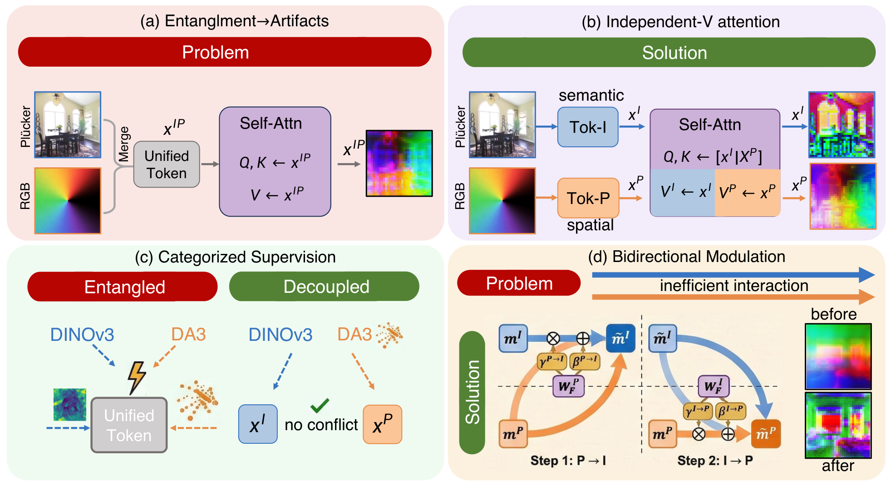

<div align="center">

# Resolving Representation Ambiguity in Feedforward Novel View Synthesis Transformer via Semantic-Spatial Decoupling

**Semantic-Spatial Decoupling for feedforward novel view synthesis transformers**

<p>
  <a href="https://arxiv.org/abs/2605.18599"></a>
  <a href="https://hangzay.github.io/ssd_lvsm/"></a>
  <a href="https://github.com/hangzay/ssd_lvsm"></a>
  <a href="LICENSE.md"></a>
</p>

<p><strong>Yihang Wu<sup>1,2*</sup>, Yihang Sun<sup>3*</sup>, Shaofeng Zhang<sup>4</sup>, Zuxuan Wu<sup>1,2</sup>, Junchi Yan<sup>3&dagger;</sup>, Xiaosong Jia<sup>1,2&dagger;</sup>, Yu-gang Jiang<sup>1,2</sup></strong></p>
<p>
  <sup>1</sup> Institute of Trustworthy Embodied Artificial Intelligence (TEAI), Fudan University<br>
  <sup>2</sup> Shanghai Key Laboratory of Multimodal Embodied AI<br>
  <sup>3</sup> Sch. of Artificial Intelligence &amp; Sch. of Computer Science, Shanghai Jiao Tong University<br>
  <sup>4</sup> University of Science and Technology of China
</p>
<p>* Equal Contributions. &dagger; Correspondence Author.</p>

Contact: [yh048172@gmail.com](mailto:yh048172@gmail.com)

</div>

## News

Our paper has been accepted to **NeurIPS 2026**.

[Visual results](#visual-results) · [Results](#controlled-results) · [Installation](#installation) · [Data](#data) · [Training](#training) · [Camera encodings](#camera-encodings) · [Evaluation](#evaluation)

## Overview

Feedforward novel view synthesis transformers commonly mix RGB appearance tokens and Plucker-ray geometry tokens in a shared latent stream. This coupling can make camera-space structure interfere with appearance representation.

Semantic-Spatial Decoupling keeps the two information types in coordinated but separate branches. RGB patch tokens form the semantic branch, Plucker-ray patch tokens form the spatial branch, shared Q/K attention preserves routing, and branch-specific values preserve heterogeneous feature updates.

<p align="center">
  
</p>

The release supports decoder-only and encoder-decoder models on RealEstate10K and Objaverse, with optional modulation and semantic/spatial supervision. Both architectures accept Plucker or raw-raymap inputs; decoder-only also supports PRoPE camera conditioning in attention.

## Visual Results

The paper's [visualization website](https://anonymous.4open.science/w/supplement-for-rebuttal-47B1/index.html) includes qualitative comparisons on 12 RealEstate10K scenes and 12 Objaverse objects, with three novel views per example, alongside rendering videos and feature analysis.

[Qualitative comparisons](https://anonymous.4open.science/w/supplement-for-rebuttal-47B1/index.html#qualitative) · [Rendering videos](https://anonymous.4open.science/w/supplement-for-rebuttal-47B1/index.html#video-results) · [Wide-angle examples](https://anonymous.4open.science/w/supplement-for-rebuttal-47B1/index.html#wide-range) · [Artifact analysis](https://anonymous.4open.science/w/supplement-for-rebuttal-47B1/index.html#artifacts)

## Controlled Results

These results follow the latest manuscript: controlled LVSM reimplementations with matched data splits, view sampling, 256×256 resolution, 50K training steps, and fixed evaluation views. Ours in the table below uses the full design: decoupling, bidirectional modulation, and semantic/spatial supervision.

| Architecture | Dataset | Baseline PSNR | Ours PSNR | Baseline LPIPS | Ours LPIPS |
| --- | --- | ---: | ---: | ---: | ---: |
| Decoder-only | RE10K | 26.10 | **27.21** | 0.144 | **0.125** |
| Decoder-only | Objaverse | 23.75 | **26.46** | 0.150 | **0.101** |
| Encoder-decoder | RE10K | 24.06 | **25.31** | 0.206 | **0.154** |

The manuscript also reports component results for all four dataset/architecture combinations. Each cell lists **PSNR ↑ / SSIM ↑ / LPIPS ↓**.

| Architecture | Dataset | Decouple only | Full design |
| --- | --- | --- | --- |
| Decoder-only | RE10K | 26.70 / 0.851 / 0.138 | **27.21 / 0.869 / 0.125** |
| Decoder-only | Objaverse | 25.96 / 0.880 / 0.112 | **26.46 / 0.899 / 0.101** |
| Encoder-decoder | RE10K | 24.84 / 0.789 / 0.170 | **25.31 / 0.806 / 0.154** |
| Encoder-decoder | Objaverse | 24.16 / 0.816 / 0.137 | **24.61 / 0.834 / 0.124** |

<details>
<summary>Camera encodings: PRoPE and raw raymaps</summary>

Camera-encoding comparisons on RE10K use the same 50K protocol. P denotes Plucker rays `[o × d, d]`; R denotes raw raymaps `[o, d]`. Params are in millions.

| Method | Params | PSNR ↑ | SSIM ↑ | LPIPS ↓ |
| --- | ---: | ---: | ---: | ---: |
| PRoPE (P) | 85.8 | 26.79 | 0.851 | 0.136 |
| LVSM (P) | 85.8 | 26.10 | 0.839 | 0.144 |
| LVSM (R) | 85.8 | 25.78 | 0.829 | 0.149 |
| Decouple (R) | 50.1 | 26.82 | 0.853 | 0.138 |
| Decouple (P) | 50.1 | 26.70 | 0.851 | 0.138 |
| Ours (P, full) | 57.2 | **27.21** | **0.869** | **0.125** |

</details>

<details>
<summary>Resolution, backbone scaling, and iLRM transfer</summary>

These RE10K experiments use **decoupling + modulation without auxiliary supervision**. The 512×512 models are fine-tuned from their corresponding 256×256, 50K checkpoints. iLRM uses its separate matched 5K protocol (2 context / 4 target views).

| Experiment | Baseline PSNR / SSIM / LPIPS | Ours PSNR / SSIM / LPIPS |
| --- | --- | --- |
| 24-layer decoder-only, 256×256, 50K | 26.18 / 0.8420 / 0.1406 | **27.37 / 0.8671 / 0.1249** |
| Decoder-only, 512×512, 8K fine-tuning | 27.47 / 0.8707 / 0.1770 | **28.28 / 0.8833 / 0.1682** |
| Decoder-only, 512×512, 10K fine-tuning | 27.45 / 0.8712 / 0.1759 | **28.19 / 0.8834 / 0.1681** |
| iLRM transfer, 256×256, 5K | 22.42 / 0.764 / 0.276 | **23.15 / 0.789 / 0.245** |

</details>

<details>
<summary>External reconstruction comparisons from the manuscript</summary>

These comparisons match data, view sampling, resolution, hardware, batch size, update budget, and evaluation. External methods retain their native losses, optimizers, and pretrained components; pretrained priors are not equated. Params are in millions.

| Dataset | Method | Params | PSNR ↑ | SSIM ↑ | LPIPS ↓ |
| --- | --- | ---: | ---: | ---: | ---: |
| RE10K | LagerNVS-DA3-S/4 | 55.3 | 24.91 | 0.801 | 0.146 |
| RE10K | MVSplat | 11.9 | 25.48 | 0.851 | 0.143 |
| RE10K | DepthSplat | 120.7 | 26.43 | 0.865 | 0.127 |
| RE10K | pixelSplat | 119.0 | 25.83 | 0.859 | 0.138 |
| RE10K | Ours (full) | 57.2 | **27.21** | **0.869** | **0.125** |
| Objaverse | LGM | 56.980 | 22.61 | 0.834 | 0.193 |
| Objaverse | Ours (full) | 57.188 | **26.46** | **0.899** | **0.101** |

</details>

[BASELINES.md](BASELINES.md) records the manuscript's baseline training settings, iLRM protocol, and separate generative references. External baseline implementations are not included in this repository.

## Installation

Clone the repository, create the environment, and install dependencies:

```bash
git clone https://github.com/hangzay/ssd_lvsm.git
cd ssd_lvsm
conda create -n decoupled-nvs python=3.11
conda activate decoupled-nvs
pip install -r requirements.txt
```

The code expects CUDA, distributed `torchrun`, and `xformers` memory-efficient attention. W&B runs offline by default; set `WANDB_MODE=online` and `WANDB_API_KEY` for online logging. An optional local key file can be copied from `configs/api_keys_example.yaml` to the Git-ignored `configs/api_keys.yaml`. Full-model training requires separately obtained DINOv3 ViT-B/16 weights and a depth/camera cache.

## Data

Preprocess RealEstate10K-style raw `.torch` files with:

```bash
python process_data.py --base_path path_to_raw_re10k/ --output_dir path_to_re10k/ --mode train
python process_data.py --base_path path_to_raw_re10k/ --output_dir path_to_re10k/ --mode test
```

Replace the `path_to_*` placeholders in the selected config before launching:

| Asset | Config field |
| --- | --- |
| RE10K scene JSON list, or Objaverse object manifest / scene list | `training.dataset_path` |
| Objaverse renders and camera poses | `training.objaverse_root`, `inference.test_objaverse_root` |
| DA3 depth/camera cache, for spatial supervision | `training.depth_camera_cache_root` |
| DINOv3 ViT-B/16 weights, for semantic supervision | `model.irepa.weight_path` |

Objaverse expects black-background renders in `rendered/<shard>/<object_id>/*.png` with matching world-to-camera `.npy` poses, or the same scene directories directly under the render root. The committed 100-object test list is excluded from training.

Spatial supervision reads the following DA3 cache per scene or object, aligns cameras, and back-projects depths into training correspondences:

```text
<depth_camera_cache_root>/<scene_id>/depth.zarr
<depth_camera_cache_root>/<scene_id>/camera_pose.zarr
<depth_camera_cache_root>/<scene_id>/camera_intrinsics.zarr
```

Objaverse also supports a shard directory before `<scene_id>`. Rendering and cache generation are external to this release. DINOv3 is loaded through Torch Hub with local weights; for offline use, set `model.irepa.repo=path_to_dinov3_source`. VGG perceptual training uses `metric_checkpoint/imagenet-vgg-verydeep-19.mat`, downloaded on first use if absent. Datasets, teacher weights, and checkpoints are not distributed here.

## Training

The released experiment families are:

| Family | Config | Paper training setting |
| --- | --- | --- |
| RealEstate10K decoder-only | `configs/re10k_decoder_only.yaml` | 4 A100 80GB, batch/GPU 4, 2 input + 6 target views |
| RealEstate10K encoder-decoder | `configs/re10k_encoder_decoder.yaml` | 4 A100 80GB, batch/GPU 4, 2 input + 6 target views |
| Objaverse decoder-only | `configs/objaverse_decoder_only.yaml` | 8 A100 80GB, batch/GPU 4, 4 input + 8 target views |
| Objaverse encoder-decoder | `configs/objaverse_encoder_decoder.yaml` | 8 A100 80GB, batch/GPU 4, 4 input + 8 target views |

All configs default to the full design at 256×256, patch size 8, width 768, and 50K optimizer updates. Decoder-only uses 12 layers; encoder-decoder uses a 12-layer encoder and 12-layer decoder. Select variants with these independent switches:

| Variant | `model.transformer.decouple` | `model.transformer.film` | `training.dino` | `training.spatial_supervision` |
| --- | --- | --- | --- | --- |
| Entangled LVSM baseline | false | false | false | false |
| Decouple only | true | false | false | false |
| Full design (default) | true | true | true | true |

Run the full RealEstate10K decoder-only model with:

```bash
bash scripts/train_re10k_decoder_full.sh
```

For example, train the decouple-only variant by overriding the full-model defaults:

```bash
torchrun --standalone --nproc_per_node=4 train.py --config configs/re10k_decoder_only.yaml \
  model.transformer.decouple=true model.transformer.film=false \
  training.dino=false training.spatial_supervision=false \
  training.checkpoint_dir=./experiments/checkpoints/re10k_decouple_only
```

Other released training entry points:

```bash
bash scripts/train_re10k_decoder_basic.sh  # Decouple only
bash scripts/train_re10k_encoder_decoder.sh
bash scripts/train_objaverse_decoder.sh
torchrun --standalone --nproc_per_node=8 train.py --config configs/objaverse_encoder_decoder.yaml
```

The shell wrappers accept trailing config overrides. Use a separate `training.checkpoint_dir` for each variant: training automatically resumes from that directory. FiLM and both auxiliary losses require decoupling. Effective batch is GPU count × batch/GPU × gradient accumulation. `checkpoint_every: 0` saves only the final checkpoint; set a positive forward-step interval for intermediate saves.

## Camera Encodings

Both architectures support `model.camera_encoding.ray_encoding=plucker` (default) or `raymap`. Decoder-only also supports `model.camera_encoding.attention_encoding=prope`; `gta` selects the pose-only control provided by the same PRoPE implementation. Encoder-decoder scene latents have no per-view camera assignment, so attention-level camera encodings are rejected.

Train the raw-raymap entangled baseline with:

```bash
torchrun --standalone --nproc_per_node=4 train.py --config configs/re10k_decoder_only.yaml \
  model.camera_encoding.ray_encoding=raymap model.transformer.decouple=false \
  model.transformer.film=false training.dino=false training.spatial_supervision=false \
  training.checkpoint_dir=./experiments/checkpoints/re10k_raymap_baseline
```

For the matched decouple-only Raymap experiment, set `model.transformer.decouple=true` and use a new checkpoint directory. For the PRoPE baseline, keep all four method switches false and set `model.camera_encoding.ray_encoding=plucker` and `model.camera_encoding.attention_encoding=prope`. The adapted source is [PRoPE's official PyTorch implementation](https://github.com/liruilong940607/prope/blob/main/prope/torch.py); see [THIRD_PARTY_NOTICES.md](THIRD_PARTY_NOTICES.md) for provenance and license details.

## Evaluation

Use the config and method switches that match the checkpoint. Teachers and depth caches are needed only for training. Evaluate a RealEstate10K decoder-only checkpoint with:

```bash
bash scripts/eval_re10k_decoder.sh \
  training.dataset_path=path_to_re10k/test/full_list.txt \
  training.checkpoint_dir=path_to_checkpoint_or_dir/ \
  inference_out_dir=path_to_eval_output/
```

Other released evaluation entry points:

```bash
bash scripts/eval_re10k_encoder_decoder.sh
bash scripts/eval_objaverse_decoder.sh
```

RealEstate10K uses the committed fixed-view index with 2 input and 3 target views; Objaverse uses its held-out object list and fixed 4 input / 8 target views. Pass the data and checkpoint paths as trailing overrides. For Objaverse encoder-decoder, launch `inference.py` with `configs/objaverse_encoder_decoder.yaml` and the following flags:

```bash
torchrun --standalone --nproc_per_node=1 inference.py --config configs/objaverse_encoder_decoder.yaml \
  inference.if_inference=true inference.compute_metrics=true \
  inference.test_objaverse_root=path_to_objaverse_rendered_data/ \
  training.target_has_input=false training.num_input_views=4 \
  training.num_target_views=8 training.num_views=12 \
  training.checkpoint_dir=path_to_checkpoint_or_dir/ \
  inference_out_dir=path_to_eval_output/
```

Evaluation writes RGB images, PSNR/SSIM/LPIPS metrics, and an HTML browser under `inference_out_dir`. Set `inference.render_video=true` for camera-path videos.

Source provenance and upstream license terms are recorded in [THIRD_PARTY_NOTICES.md](THIRD_PARTY_NOTICES.md).

## BibTeX

```bibtex
@misc{wu2026resolvingrepresentationambiguityfeedforward,
      title={Resolving Representation Ambiguity in Feedforward Novel View Synthesis Transformer via Semantic-Spatial Decoupling},
      author={Yihang Wu and Yihang Sun and Shaofeng Zhang and Zuxuan Wu and Junchi Yan and Xiaosong Jia and Yu-gang Jiang},
      year={2026},
      eprint={2605.18599},
      archivePrefix={arXiv},
      primaryClass={cs.CV},
      url={https://arxiv.org/abs/2605.18599},
}
```
